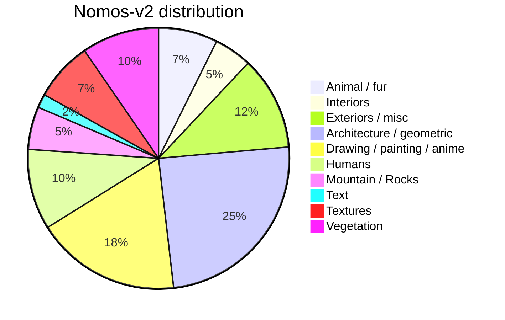

> [!NOTE]
> The package `lmdb` is required. It may only work with python <=3.11

## 📸 datasets

As part of *neosr*, I have released a dataset series called *Nomos*. The purpose of these dataset is to distill only the best images from the academic and community datasets. A total of 14 datasets were manually reviewed and processed, including: [Adobe-MIT-5k](https://data.csail.mit.edu/graphics/fivek/), [RAISE](http://loki.disi.unitn.it/RAISE/), [LSDIR](https://data.vision.ee.ethz.ch/yawli/), [LIU4k-v2](https://structpku.github.io/LIU4K_Dataset/LIU4K_v2.html), [KONIQ-10k](https://database.mmsp-kn.de/koniq-10k-database.html), [Nikon LL RAW](https://www.kaggle.com/datasets/razorblade/nikon-camera-dataset), [DIV8k](https://ieeexplore.ieee.org/document/9021973), [FFHQ](https://github.com/NVlabs/ffhq-dataset), [Flickr2k](http://cv.snu.ac.kr/research/EDSR/Flickr2K.tar), [ModernAnimation1080_v2](https://huggingface.co/datasets/Zarxrax/ModernAnimation1080_v2), [Rawsamples](https://www.rawsamples.ch/index.php/en/), [SignatureEdits](https://www.signatureedits.com/free-raw-photos/), [Hasselblad raw samples](https://www.hasselblad.com/learn/sample-images/) and [Unsplash](https://unsplash.com/).

- `Nomos-v2` (*recommended*): contains 6000 images, multipurpose. Data distribution:

- `nomos_uni` (*recommended for lightweight networks*): contains 2989 images, multipurpose. Meant to be used on lightweight networks (<800k parameters).
- `hfa2k`: contains 2568 anime images.

|                                               dataset download                                                        |                                               sha256                                            |
|-----------------------------------------------------------------------------------------------------------------------|-------------------------------------------------------------------------------------------------|
| [**nomosv2**](https://drive.google.com/file/d/1vqKWGtpkYHKv8uqK_xgYZbYuPHJS2l8j/view?usp=drive_link) (3GB)            | [sha256](https://drive.google.com/file/d/12eNzPqHd2N1rTWMDh_rAv3urNypJexQT/view?usp=drive_link) |
| [**nomosv2.lmdb**](https://drive.google.com/file/d/1Rzdjt3w0qXle7vHa8FeFltmyKTMIwPR5/view?usp=drive_link) (3GB)       | [sha256](https://drive.google.com/file/d/1IrDjI37psiCc-Khn3_KSyov-xP4txZYe/view?usp=drive_link) |
| [nomosv2_lq_4x](https://drive.google.com/file/d/1YiCywSFwRuwaYmnZ0TgoWDvcDQifAsZo/view?usp=drive_link) (187MB)        | [sha256](https://drive.google.com/file/d/1iOOte6h-AE1iD-i5wl_gVx1uJzNTS4Cq/view?usp=drive_link) |
| [nomosv2_lq_4x.lmdb](https://drive.google.com/file/d/1IrDjI37psiCc-Khn3_KSyov-xP4txZYe/view?usp=drive_link) (187MB)   | [sha256](https://drive.google.com/file/d/1bpuuiGFNBrDuZiRSP5hpVgFQx44MImay/view?usp=drive_link) |
| [nomos_uni](https://drive.google.com/file/d/1LVS7i9J3mP9f2Qav2Z9i9vq3y2xsKxA_/view?usp=sharing) (1.3GB)               | [sha256](https://drive.google.com/file/d/1cdzVSpXQQhcbRVuFPbNtb6mZx_BoLwyW/view?usp=sharing)    |
| [nomos_uni.lmdb](https://drive.google.com/file/d/1MHJCS4Zl3H5nihgpA_VVliziXnhJ3aU7/view?usp=sharing) (1.3GB)          | [sha256](https://drive.google.com/file/d/1g3XLV-hFdLUcuAHLv2R6Entye8MkMx0V/view?usp=drive_link) |
| [nomos_uni_lq_4x](https://drive.google.com/file/d/1uvMl8dG8-LXjCOEoO9Aiq5Q9rd_BIUw9/view?usp=sharing)                 | [sha256](https://drive.google.com/file/d/1MTJBcfaMYdfWhsZCWEEOwbKSdmN5dVwl/view?usp=drive_link) |
| [nomos_uni_lq_4x.lmdb](https://drive.google.com/file/d/1h27AsZze_FFsAsf8eXupcqIZQHhvwa1y/view?usp=sharing)            | [sha256](https://drive.google.com/file/d/1dhvIlM_uaIYMEKuijemnlmMTg4qf7bj7/view?usp=drive_link) |
| [hfa2k](https://drive.google.com/file/d/1PonJdHWwCtBdG4i1LwThm06t6RibnVu8/view?usp=sharing)                           | [sha256](https://drive.google.com/file/d/1ojDSyKCnCDoLOf9C-Zo4-BmuVSNTItEl/view?usp=sharing)    |

See more datasets on the [**readme section about datasets**](https://github.com/muslll/neosr?tab=readme-ov-file#datasets).

## utils

In the [utils](utils/) folder you can find some tools to help prepare datasets, such as generating meta info files and converting to LMDB.
