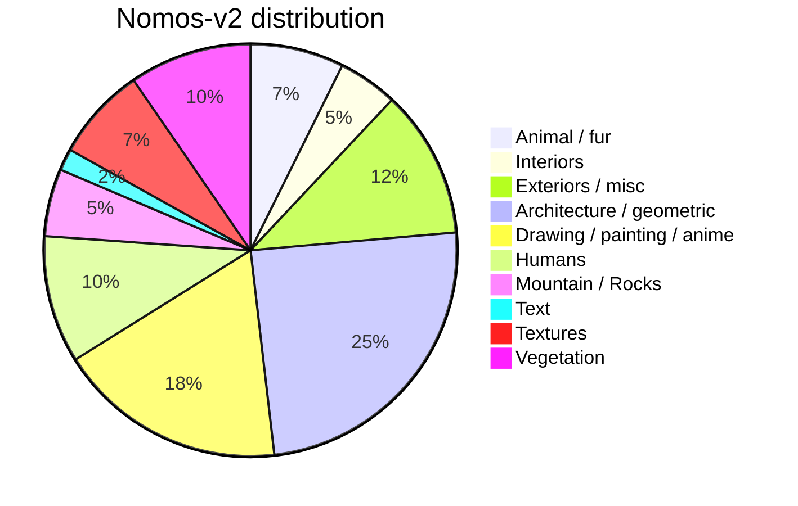

<div align="center">
<a href=https://github.com/muslll/neosr><b>neosr</b></a> is a framework for training real-world single-image super-resolution networks. <a href=https://github.com/muslll/neosr/wiki><b>wiki</b></a>.
<br><br>
<a href="https://discord.gg/NN2HGtJ3d6"></a><br>
Join our <a href="https://discord.gg/NN2HGtJ3d6">Discord</a>
</div>

<details>
  <summary><b>news</b></summary>
  06.19.2024 - neosr now supports SOTA optimization through <a href="https://github.com/muslll/adan_schedule_free">Adan Schedule-Free</a> and <a href="https://github.com/nblt/F-SAM">F-SAM</a><br>
  05.09.2024 - Release Real-PLKSR network. <a href=https://github.com/muslll/neosr/wiki/Arch%E2%80%90specific-options#realplksr-realplksr_s>wiki</a><br>
  05.08.2024 - Release <b>Nomos-v2</b> dataset. For more details, see <a href=#datasets>datasets</a><br>
</details>

## 🤝 support me

> [!TIP]
> Consider supporting me on [**KoFi**](https://ko-fi.com/muslll) &#9749; or [**Patreon**](https://www.patreon.com/neosr)

## 💻 installation

Requires Python 3.12 and CUDA =>11.8.
Install latest [Pytorch (=>2.3) and TorchVision](https://pytorch.org/get-started/locally/) (required).

Clone the repository:

```
git clone https://github.com/muslll/neosr
cd neosr
```

Then install other dependencies via `pip`:

```
pip install -e .
```

Alternatively, use [**`poetry`**](https://python-poetry.org/docs/#installation) (*recommended on linux*):

```
poetry install
poetry add torch@latest torchvision@latest
```
Note: You must use `poetry shell` to enter the env after installation.

***(optional)*** If you want to convert your models ([convert.py](convert.py)), you need the following dependencies:

```
pip install onnx onnxruntime-gpu onnxconverter-common onnxsim
```

You can also install using poetry (*recommended on linux*):

```
poetry add onnx onnxruntime-gpu onnxconverter-common onnxsim
```

Please read the [**wiki tutorial**](https://github.com/muslll/neosr/wiki/Model-Conversion) for converting your models.

## quick start

Start training by running:

```
python train.py -opt options.toml
```
Where `options.toml` is a configuration file. Templates can be found in [options](options/).

> [!TIP]
> Please read the wiki [Configuration Walkthrough](https://github.com/muslll/neosr/wiki/Configuration-Walkthrough) for an explanation of each option.

## features

### [Supported Archs](https://github.com/muslll/neosr/wiki/Arch%E2%80%90specific-options):

| arch                                                                                              | option                                 			|
|---------------------------------------------------------------------------------------------------|-----------------------------------------------------------|
| [Real-ESRGAN](https://github.com/xinntao/Real-ESRGAN)                                             | `esrgan`                               			|
| [SRVGGNetCompact](https://github.com/XPixelGroup/BasicSR/blob/master/basicsr/archs/srvgg_arch.py) | `compact`                              			|
| [SwinIR](https://github.com/JingyunLiang/SwinIR)                                                  | `swinir_small`, `swinir_medium`        			|
| [HAT](https://github.com/XPixelGroup/HAT)                                                         | `hat_s`, `hat_m`, `hat_l`              			|
| [OmniSR](https://github.com/Francis0625/Omni-SR)                                                  | `omnisr`                               			|
| [SRFormer](https://github.com/HVision-NKU/SRFormer)                                               | `srformer_light`, `srformer_medium`    			|
| [DAT](https://github.com/zhengchen1999/dat)                                                       | `dat_small`, `dat_medium`, `dat_2` 			|
| [DITN](https://github.com/yongliuy/DITN)							    | `ditn`				     	      		|
| [DCTLSA](https://github.com/zengkun301/DCTLSA)						    | `dctlsa`							|
| [SPAN](https://github.com/hongyuanyu/SPAN)							    | `span`							|
| [Real-CUGAN](https://github.com/bilibili/ailab)				  		    | `cugan`			   				|
| [CRAFT](https://github.com/AVC2-UESTC/CRAFT-SR)		 				    | `craft`			   				|
| [SAFMN](https://github.com/sunny2109/SAFMN)							    | `safmn`, `safmn_l`					|
| [RGT](https://github.com/zhengchen1999/RGT)							    | `rgt`, `rgt_s` 						|
| [ATD](https://github.com/LabShuHangGU/Adaptive-Token-Dictionary)   				    | `atd`, `atd_light`   					|
| [PLKSR](https://github.com/dslisleedh/PLKSR)			     				    | `plksr`, `plksr_tiny`	    				|
| [RealPLKSR](https://github.com/dslisleedh/PLKSR/issues/4)					    | `realplksr`, `realplksr_s`				|
| [DRCT](https://github.com/ming053l/DRCT)			     				    | `drct`, `drct_l`, `drct_s`   				|
| [MSDAN](https://github.com/Supereeeee/MSDAN)			     				    | `msdan`			    				|
| [SPANPlus](https://github.com/umzi2/SPANPlus)							    | `spanplus`, `spanplus_sts`, `spanplus_s`, `spanplus_st`   |

> [!NOTE]
> For all arch-specific parameters, [read the wiki](https://github.com/muslll/neosr/wiki/Arch%E2%80%90specific-options).

#### Under Testing

| arch                                          		     | option               	     	    |
|--------------------------------------------------------------------|--------------------------------------|


### Supported Discriminators:

| net                               				  		| option 		        |
|-------------------------------------------------------------------------------|-------------------------------|
| U-Net w/ SN 							  		| `unet` 		        |
| [PatchGAN](https://github.com/NVIDIA/pix2pixHD) w/ SN		  		| `patchgan`			|
| EA2FPN (bespoke, based on [A2-FPN](https://github.com/lironui/A2-FPN)		| `ea2fpn`			|

### [Supported Optimizers](https://github.com/muslll/neosr/wiki/Optimizer-Options):

| optimizer                                                                 | option             	 |
|---------------------------------------------------------------------------|----------------------------|
| [Adam](https://pytorch.org/docs/stable/generated/torch.optim.Adam.html)   | `Adam` or `adam`   	 |
| [AdamW](https://pytorch.org/docs/stable/generated/torch.optim.AdamW.html) | `AdamW` or `adamw` 	 |
| [NAdam](https://pytorch.org/docs/stable/generated/torch.optim.NAdam.html) | `NAdam` or `nadam` 	 |
| [Adan](https://github.com/sail-sg/Adan)                                   | `Adan` or `adan`   	 |
| [AdamW Win2](https://github.com/sail-sg/win)				    | `AdamW_Win` or `adamw_win` |
| [ECO strategy](https://github.com/2minkyulee/ECO)			    | `eco`, `eco_iters`	 |
| [AdamW Schedule-Free](https://github.com/facebookresearch/schedule_free)  | `adamw_sf`		 |
| [Adan Schedule-Free](https://github.com/muslll/adan_schedule_free)	    | `adan_sf`			 |
| [F-SAM](https://github.com/nblt/F-SAM)				    | `fsam`, `FSAM`		 |

### [Supported Losses](https://github.com/muslll/neosr/wiki/Losses):

| loss                                                                   						| option               		      	     |
|-----------------------------------------------------------------------------------------------------------------------|--------------------------------------------|
| L1 Loss                                                                						| `L1Loss`, `l1`       		     	     |
| L2 Loss                                                                						| `MSELoss`, `l2`      		     	     |
| Huber Loss                                                             						| `HuberLoss`, `huber` 		     	     |
| CHC (Clipped Huber with Cosine Similarity Loss)			 						| `chc`, `chc_l2`			     |
| Perceptual Loss                                                        						| `perceptual_opt`, `PerceptualLoss`         |
| GAN                                                                    						| `gan_opt`, `GANLoss`, `MultiScaleGANLoss`  |
| Y**CbCr** Color Loss (bt601)                                           						| `color_opt`, `colorloss`                   |
| Luma Loss (CIE L*)						 							| `luma_opt` `lumaloss`		     	     |
| [MS-SSIM](https://github.com/lartpang/mssim.pytorch)			 						| `mssim_opt` `mssim`			     |
| [LDL Loss](https://github.com/csjliang/LDL)                            						| `ldl_opt`  			             |
| [Focal Frequency](https://github.com/EndlessSora/focal-frequency-loss) 						| `ff_opt`, `focalfrequencyloss`             |
| [DISTS](https://github.com/dingkeyan93/DISTS)				 						| `dists_opt`, `dists`			     |
| [Wavelet Guided](https://github.com/mandalinadagi/WGSR)		 						| `wavelet_guided`			     |
| [Gradient-Weighted](https://github.com/xiezw5/Component-Divide-and-Conquer-for-Real-World-Image-Super-Resolution/)	| `gw_opt`, `gw_loss`			     | 
| [Perceptual Patch Loss](https://github.com/Suanmd/Patch-Loss-for-Super-Resolution)					| `perceptual_opt`, `patchloss`, `ipk`	     |

### Supported Augmentations:

| augmentation						| option	|
|-------------------------------------------------------|---------------|
| Rotation						| `use_rot`	|
| Flip							| `use_hflip`	|
| [MixUp](https://arxiv.org/abs/1710.09412)		| `mixup`	|
| [CutMix](https://arxiv.org/abs/1905.04899)		| `cutmix`	|
| [ResizeMix](https://arxiv.org/abs/2012.11101)		| `resizemix`	|
| [CutBlur](https://github.com/clovaai/cutblur/)	| `cutblur`	|

### Supported Models:

| model   | description                                                            | option    |
|---------|------------------------------------------------------------------------|-----------|
| Default | Base model, supports both Generator and Discriminator                  | `default` |
| OTF     | Builds on top of `default`, adding Real-ESRGAN on-the-fly degradations | `otf`     |

### Supported dataset loaders:

| loader                                          | option   |
|-------------------------------------------------|----------|
| Paired datasets                                 | `paired` |
| Single datasets (for inference, no GT required) | `single` |
| Real-ESRGAN on-the-fly degradation              | `otf`    |

## 📸 datasets

As part of *neosr*, I have released a dataset series called *Nomos*. The purpose of these datasets is to distill only the best images from the academic and community datasets. A total of 14 datasets were manually reviewed and processed, including: [Adobe-MIT-5k](https://data.csail.mit.edu/graphics/fivek/), [RAISE](http://loki.disi.unitn.it/RAISE/), [LSDIR](https://data.vision.ee.ethz.ch/yawli/), [LIU4k-v2](https://structpku.github.io/LIU4K_Dataset/LIU4K_v2.html), [KONIQ-10k](https://database.mmsp-kn.de/koniq-10k-database.html), [Nikon LL RAW](https://www.kaggle.com/datasets/razorblade/nikon-camera-dataset), [DIV8k](https://ieeexplore.ieee.org/document/9021973), [FFHQ](https://github.com/NVlabs/ffhq-dataset), [Flickr2k](http://cv.snu.ac.kr/research/EDSR/Flickr2K.tar), [ModernAnimation1080_v2](https://huggingface.co/datasets/Zarxrax/ModernAnimation1080_v2), [Rawsamples](https://www.rawsamples.ch/index.php/en/), [SignatureEdits](https://www.signatureedits.com/free-raw-photos/), [Hasselblad raw samples](https://www.hasselblad.com/learn/sample-images/) and [Unsplash](https://unsplash.com/). 

- `Nomos-v2` (**recommended**): contains 6000 images, multipurpose. Data distribution:



- `nomos_uni` (*recommended for lightweight networks*): contains 2989 images, multipurpose. Meant to be used on lightweight networks (<800k parameters).
- `hfa2k`: contains 2568 anime images.

| 						dataset download   							| 						sha256						  |
|-----------------------------------------------------------------------------------------------------------------------|-------------------------------------------------------------------------------------------------|
| [**nomosv2**](https://drive.google.com/file/d/1vqKWGtpkYHKv8uqK_xgYZbYuPHJS2l8j/view?usp=drive_link) (3GB)		| [sha256](https://drive.google.com/file/d/12eNzPqHd2N1rTWMDh_rAv3urNypJexQT/view?usp=drive_link) |
| [**nomosv2.lmdb**](https://drive.google.com/file/d/1Rzdjt3w0qXle7vHa8FeFltmyKTMIwPR5/view?usp=drive_link) (3GB)	| [sha256](https://drive.google.com/file/d/1IrDjI37psiCc-Khn3_KSyov-xP4txZYe/view?usp=drive_link) |
| [nomosv2_lq_4x](https://drive.google.com/file/d/1YiCywSFwRuwaYmnZ0TgoWDvcDQifAsZo/view?usp=drive_link) (187MB)	| [sha256](https://drive.google.com/file/d/1iOOte6h-AE1iD-i5wl_gVx1uJzNTS4Cq/view?usp=drive_link) |
| [nomosv2_lq_4x.lmdb](https://drive.google.com/file/d/1IrDjI37psiCc-Khn3_KSyov-xP4txZYe/view?usp=drive_link) (187MB)	| [sha256](https://drive.google.com/file/d/1bpuuiGFNBrDuZiRSP5hpVgFQx44MImay/view?usp=drive_link) |
| [nomos_uni](https://drive.google.com/file/d/1LVS7i9J3mP9f2Qav2Z9i9vq3y2xsKxA_/view?usp=sharing) (1.3GB)		| [sha256](https://drive.google.com/file/d/1cdzVSpXQQhcbRVuFPbNtb6mZx_BoLwyW/view?usp=sharing)	  |
| [nomos_uni.lmdb](https://drive.google.com/file/d/1MHJCS4Zl3H5nihgpA_VVliziXnhJ3aU7/view?usp=sharing) (1.3GB)		| [sha256](https://drive.google.com/file/d/1g3XLV-hFdLUcuAHLv2R6Entye8MkMx0V/view?usp=drive_link) |
| [nomos_uni_lq_4x](https://drive.google.com/file/d/1uvMl8dG8-LXjCOEoO9Aiq5Q9rd_BIUw9/view?usp=sharing)			| [sha256](https://drive.google.com/file/d/1MTJBcfaMYdfWhsZCWEEOwbKSdmN5dVwl/view?usp=drive_link) |
| [nomos_uni_lq_4x.lmdb](https://drive.google.com/file/d/1h27AsZze_FFsAsf8eXupcqIZQHhvwa1y/view?usp=sharing)		| [sha256](https://drive.google.com/file/d/1dhvIlM_uaIYMEKuijemnlmMTg4qf7bj7/view?usp=drive_link) |
| [hfa2k](https://drive.google.com/file/d/1PonJdHWwCtBdG4i1LwThm06t6RibnVu8/view?usp=sharing)				| [sha256](https://drive.google.com/file/d/1ojDSyKCnCDoLOf9C-Zo4-BmuVSNTItEl/view?usp=sharing)	  |


### community datasets

Datasets made by the upscaling community. More info can be found in author's repository.

- `FaceUp`: Curated version of [FFHQ](https://github.com/NVlabs/ffhq-dataset)
- `SSDIR`: Curated version of [LSDIR](https://data.vision.ee.ethz.ch/yawli/).

| dataset                                                | download 												      |
|--------------------------------------------------------|------------------------------------------------------------------------------------------------------------|
| [@Phhofm](https://github.com/Phhofm) FaceUp            | [GDrive (4GB)](https://drive.google.com/file/d/1WFY0siR_ERVSnE2p7ouiCfV3wQizpAKr/view)                     |
| [@Phhofm](https://github.com/Phhofm) SSDIR             | [Gdrive (4.5GB)](https://drive.google.com/file/d/1FA8Q-T3xZ6_KA7SHYgoa6idIS7xpdrl4/view)                   |

## resources

- [Training Guide](https://github.com/Sirosky/Upscale-Hub/wiki/%F0%9F%93%88-Training-a-Model-in-NeoSR) from [@Sirosky](https://github.com/Sirosky) 
- Philip's [youtube channel](https://www.youtube.com/@philip_hofmann/videos)
- Training info from [Upscale-Community](https://github.com/Upscale-Community/training-info).
- [OpenModelDB](https://openmodeldb.info/)
- [chaiNNer](https://chainner.app/)

## 📄 license and acknowledgements

Released under the [Apache license](license.txt).
All licenses listed on [license/readme](license/readme.md).
This code was originally based on [BasicSR](https://github.com/XPixelGroup/BasicSR). 

Thanks to [victorca25/traiNNer](https://github.com/victorca25/traiNNer), [styler00dollar/Colab-traiNNer](https://github.com/styler00dollar/Colab-traiNNer/) and [timm](https://github.com/huggingface/pytorch-image-models) for providing helpful insights into some problems.

Thanks to contributors [@Phhofm](https://github.com/Phhofm), [@Sirosky](https://github.com/Sirosky), [@terrainer](https://github.com/terrainer), [@Corpsecreate](https://github.com/Corpsecreate) and [@umzi2](https://github.com/umzi2) for helping with tests and bug reporting. 
